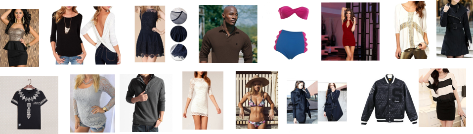
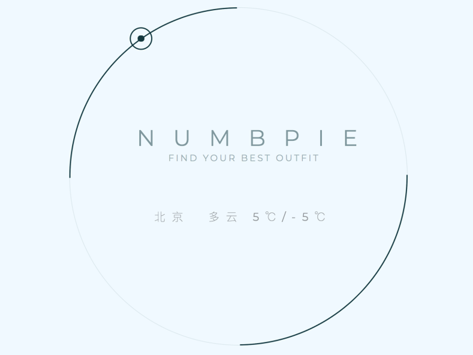
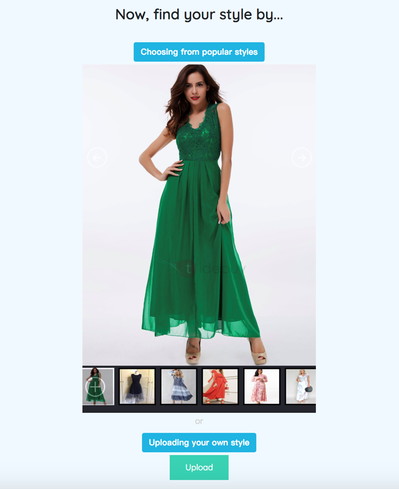
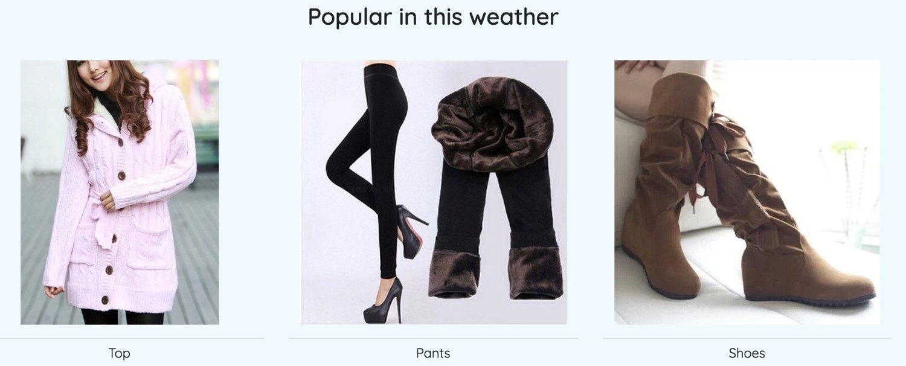
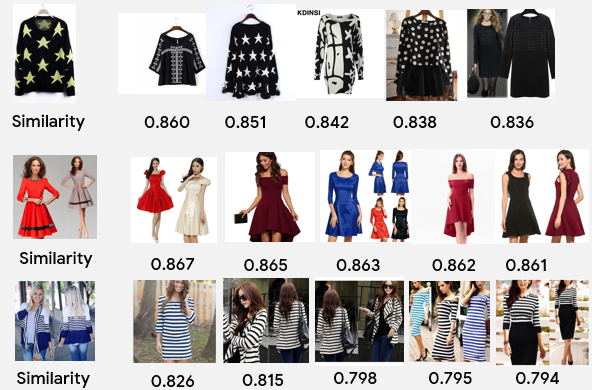
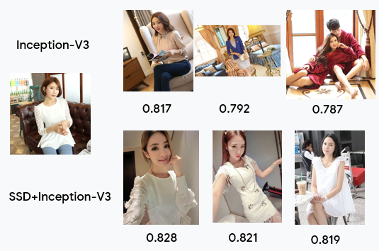

# numbpie

The repository contains a web demo of personalized fashion searching. The millions of fashion images come from a large scale dataset called [iMaterialist](https://www.kaggle.com/c/imaterialist-challenge-fashion-2018/data), which is a challenge on Kaggle. 

 

## Demo
You can simply run [app.py](https://github.com/wozhouh/numbpie/blob/master/web/numbpie/app.py) to start the web application on port 4321, and you can see the UI as below. Of course you should make sure that you have installed the packages required, and put the weights and images under the correct path, which can be configured in [Searcher.py](https://github.com/wozhouh/numbpie/blob/master/code/Searcher.py).

 

The demo allows users to upload a fashion image of interest or directly choose from the given, then search for a similar style in the dataset. Then it returns top-5 most similar and their scores (from 0.0 ~ 1.0 and 0.80+ ideally). Also, it provides users with some labels to design their own fashion. They can click some tags and the fashion style will change accordingly, e.g. shorten or extend the sleeves, add or remove some stripes or florals and so on. Seaching with a modified fashion style, it returns a fashion of both the given and personalized style. So cool isn't it? Feel free to try!

Some top-5 retrieved fashion images could be referred as below.

## Models

The demo consists of three models actually. The [first one](https://github.com/wozhouh/numbpie/tree/master/code/feature_extractor) is an embedding model with Inception-V3 as backbone. It converts fashion images into embeddings, and serach the similar ones using cosine distance, so that we are able to compare the similarity of two images directly. The second one is an object detector based on VGG-SSD, which crops the RoI to make the feature extractor above focus on the main part in the images. The figure below show that the detector helps the extractor focus on the object instead of the background. The third is three GAN models, which change the fashion style with given tags. More than ten tags are provided here, like "sleeve length: long", "fit: loose" and "neckline: wide".

The SSD model refers to a popular TensorFlow [implementation](https://github.com/balancap/SSD-Tensorflow). The GAN models refer to a [repository](https://github.com/sonynka/fashion_gan) related to fashion generation.

In order to run the demo immediately, you should make the following preparations including the model weights, features and images. You can download the frozen graph of the feature extractor and the SSD from [Google Drive](https://drive.google.com/open?id=1iD9wQMoBQUKL2fKF4dL2ktQqnt7KZGVn). You can download images as the gallery from iMaterialist and corresponding pre-extracted features of the test set. And you can download the models and features for GAN usage using the [script](https://github.com/wozhouh/numbpie/blob/master/code/fashion_gan/data/download_data.sh). Do not forget to configure the path in [Searcher.py](https://github.com/wozhouh/numbpie/blob/master/code/Searcher.py) for output so that the web can refresh in time.
